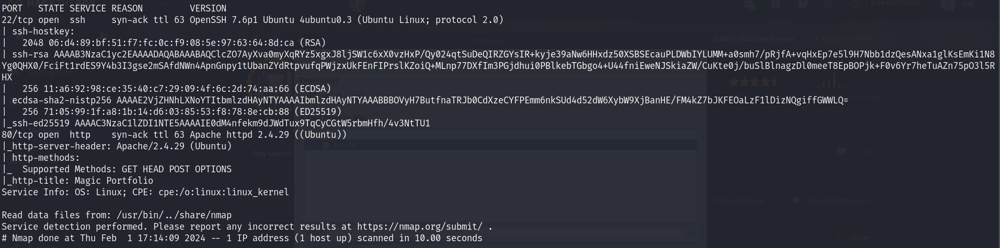

# Image - Hack the Box


## Enumeration

Started off wth a couple nmap scans, these were relevant results:



From here, I decided to explore the Web service right away. I initially started a directory search brute-force scan, while navigtating the page hoping to find interesting, potential dangerous functionalities. All I could found was a login panel, and the "public structure" of the web application, which is always good to know. Static files were in the `/assets` directory, respectively `js`, `css`, `sass` and `webfonts`. Interestingly, the images were fetched from `/images`, such as `images/uploads/`. Again, always good to keep this in mind.

Besides the information above, it is always good to learn the server version, along with the framework implemented. In this case, it is an apache server running PHP. One, could not learn the PHP version, but hopefully it is old.

On the login page, as it is shown below, there are a couple things that an experienced hacker should be thinking right away, for instance, SQL injections, Type Juggling vulnerabilies, flawed logic implementation...

## User Flag


Attempting a basic payload, with the help of Burpsuite, bypasses the authentication mechanism


Keep in mind that the payload above most likely logged us in with a random user from the database. To select a specific user to bypass its authentication, one can use the following payload `user' AND 1=1 -- -` which will effectively be only true if that _user_ exists.

Authenticated, and since the _gobuster_ did not show anything relevant


One can directly start exploring this File Upload functionality. Immediatly, one would notice it only accept certain types of images, based on their extension.

```
// Check if image file is a actual image or fake image
if (isset($_POST["submit"]))
{
    // Allow certain file formats
    $imageFileType = strtolower(pathinfo($target_file, PATHINFO_EXTENSION));
    if ($imageFileType != "jpg" && $imageFileType != "png" && $imageFileType != "jpeg") {
        echo "<script>alert('Sorry, only JPG, JPEG & PNG files are allowed.')</script>";
        $uploadOk = 0;
    }

    if ($uploadOk === 1) {
        // Check if image is actually png or jpg using magic bytes
        $check = exif_imagetype($_FILES["image"]["tmp_name"]);
        if (!in_array($check, $allowed)) {
            echo "<script>alert('What are you trying to do there?')</script>";
            $uploadOk = 0;
        }
    }
    //Check file contents
    /*$image = file_get_contents($_FILES["image"]["tmp_name"]);
    if (strpos($image, "<?") !== FALSE) {
        echo "<script>alert('Detected \"\<\?\". PHP is not allowed!')</script>";
        $uploadOk = 0;
    }*/

    // Check if $uploadOk is set to 0 by an error
    if ($uploadOk === 1) {
        if (move_uploaded_file($_FILES["image"]["tmp_name"], $target_file)) {
            echo "The file " . basename($_FILES["image"]["name"]) . " has been uploaded.";
        } else {
            echo "Sorry, there was an error uploading your file.";
        }
    }
}
```

Interestingly, as the code above shows, the upload functionality starts by comparing the file extension to the ones whitelisted,and proceeds to comapre the magic bytes of the file uplaoded to the respective extension. Lastly, a `<?` string validation would be performed on the contents of the file, however, the user commented out this section, effectively removing this protection. Though at this point, one would think that it would be impossible to bypass such functionality, there is a well known bug for certain versions of PHP: https://owasp.org/www-community/attacks/Embedding_Null_Code

Essentially, though the file would look like a image, `.php%00.png` because of the `%00`, PHP null terminates when the file is requested, essnetially rendering a php file.

This bypasses the defensive mechanisms, and stores the contents as a `.php`file. Lastly, one needs to find out where the file was uploaded. Knowing from before, that exsists a path `/images/uploads`, that is a perfect place to check for the uploaded file.

Remember that the file is partially an image because it contains the `.PNG` magic bytes, followed by the php shell.

Though the file is indeed uploaded as `shell.php%00.png`, as shown below:


When requested, the %00 will essentially truncate the path, and transform the "image" into a php file, effectively running our php code that triggers a reverse shell.

One spawns as www-data, as usual. In Apache based web servers, I normally visit the `config.php` to find database leaks and dump the conent of the database. In this case, I previously dumped the database throught Conditional SQLi (through response status), or simply `sqlmap`, so I knew that the admin user for the web application has the password `Th3s3usW4sK1ng`. Envouraged by the password, I attempted to switch user to `theseus` with that password and voilà, the first flag is obtained.

## Root Flag

The first thing I usually do is to manually enumerate the server. I verify sudo previlleges, processes, network configuration, cronjobs, capabilities, machine information (etc.). Sequentially, if there are no interesting findings, I run `linpeas.sh`.

In this case, _linpeas_ confirmed the existence of an unkown SUID binary, `/bin/sysinfo`. Though I was initially fooled by the existence of a manual page for sysinfo, which does not have a GTFO Bins exploit, it took me a while to comeback to this program. Eventually I decided to download and Reverse Engineer the program, hopefully to find some poorly, vulnerable code. Before I launched _ghidra_, I noticed with the help of `ltrace` that the program was launching a process that executed a command, and read its output. In fact, exploring the program execution, I noticed the following call `popen("fdisk -l", "r")`. Having noticed that the program is executing `fdisk` based on the `$PATH` environment variable, if I was able to change this variable I would run my program (`/malicious_path/fdisk`) instead of the legitimate one.

Creating a file under `/home/theseus` named `fdisk`, with the following contents:

```
#!/bin/bash

chmod +s /bin/bash
```

And changing the previlleges, to become an executable, when run the `/bin/bash` would effectively become SUID giving root to whomever spawns a new shell.

Afterwards, I simply changed the `$PATH` variable and executed the `sysinfo` binary:

1. Export the new path to execute programs under current directory first.
   `PATH=$(pwd):$PATH`

2. Execute `sysinfo` to effective run the malicious code
   `/bin/sysinfo`

3. Spawn new shell as root
   `/bin/bash -p`

Done.
